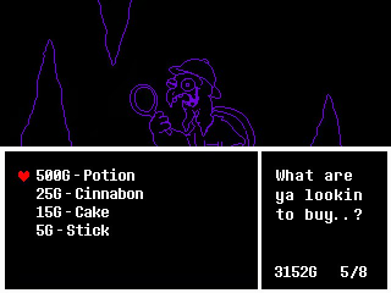
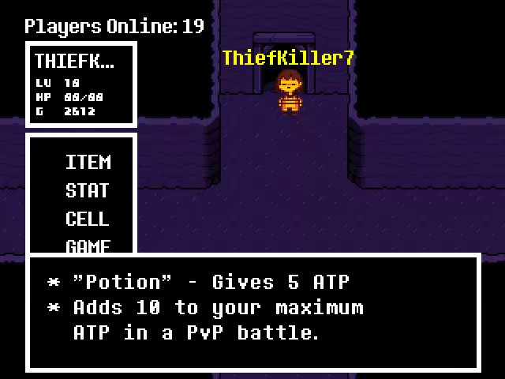
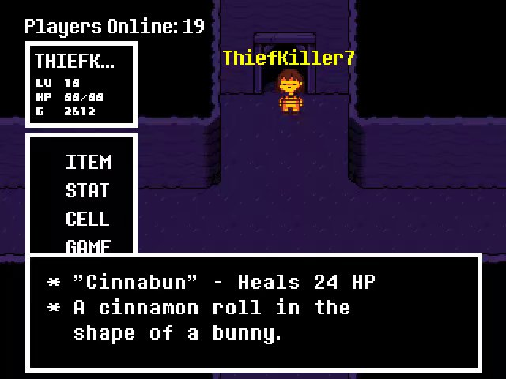
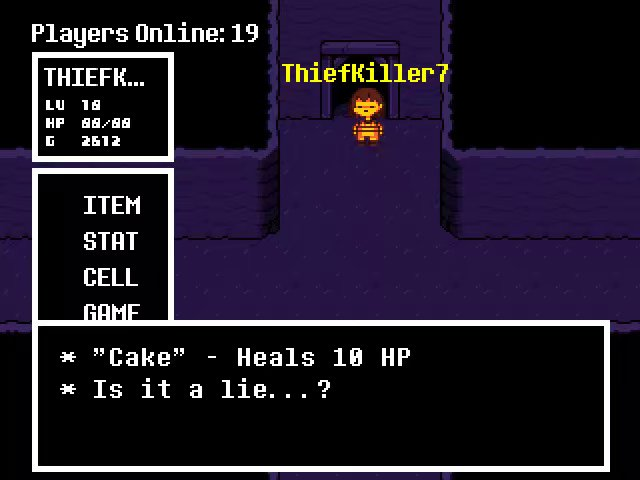

# 7.1.Gerson一号

——Gerson一号——

位于出生点附近，这里卖的东西除了Potion外都能在兔子老板那买到更便宜的同样的东西

500G Potion/蓝药
ATP是本游戏类似于MP的单位，在PVP中需要消耗ATP释放魔法

​			 ①战斗外使用，增加ATP上限10点

​	 ②PVP使用，回满ATP
初始ATP上限为30，恰药后最高上限为100，所以只是提高ATP上限的话7瓶就够了

25G Cinnabon/肉桂卷 HP+24
买到手中会变成Cinnabun

15G Cake/蛋糕 HP+10
梗来自“蛋糕是个谎言”

5G Stick/树枝
用途不明

​	