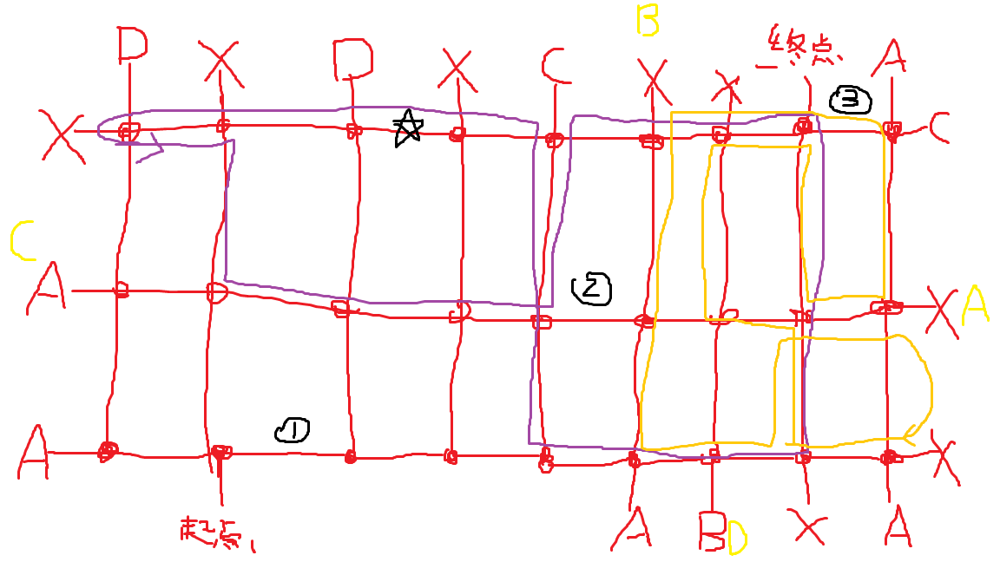

# 4.6.森林迷宫

位于Village的上方的森林迷宫，同时也是拔剑、拼图收集等的必经之路
森林中有黑色人影，碰到会被遣返至迷宫起点，还请注意

↓我本人画的草图

红色字母代表进入后会被转送到黄色字母所在地，红色的X则代表进入后会被遣返至迷宫起点，黑色的①②③代表迷宫内的三块石碑，有内容可以注意一下，黑色的五角星代表第34块拼图，蓝色和橙色的线是黑色人影的巡逻路线

所以最近路程则为进入后左转传送到A路口，然后出门上左上即可到达终点	