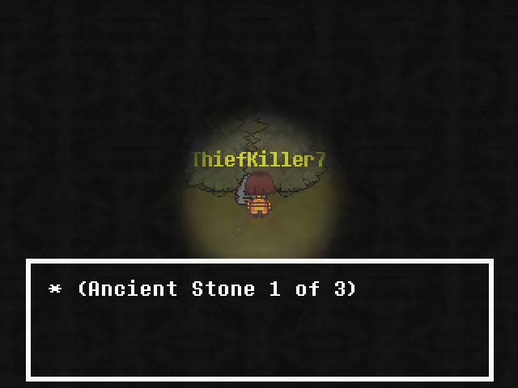
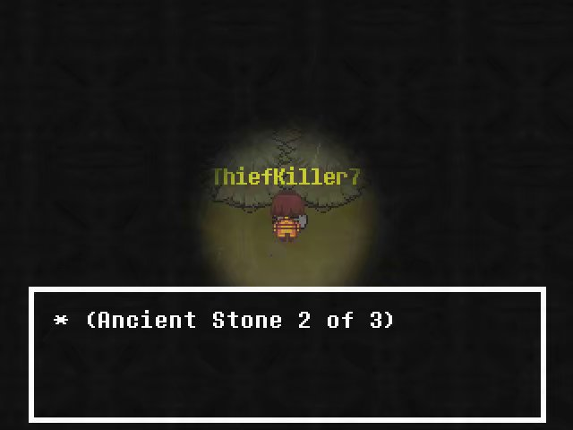
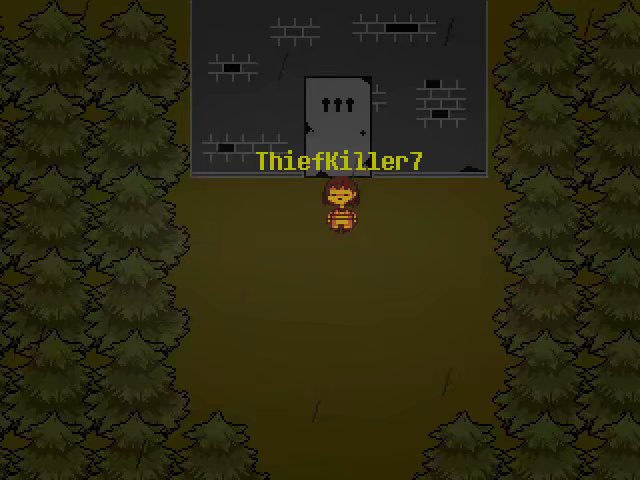
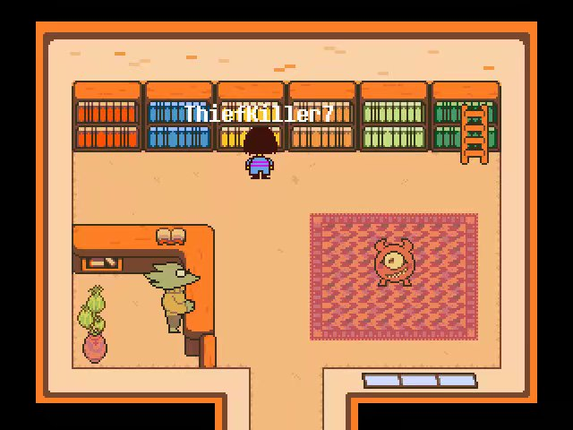
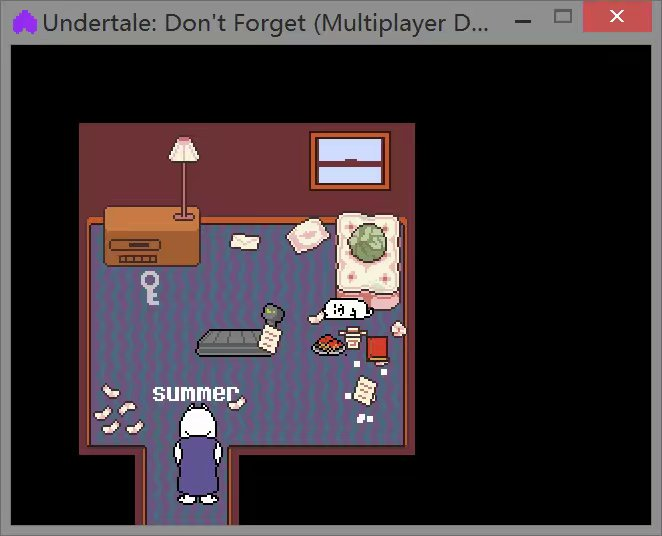

# 1.2.Village森林迷宫走法

森林迷宫里有黑色人影，和其对话会被遣返到入口

注:石碑可以不用调查

进门右转能发现石碑1号

进门左转到头切换地图，向左走4个路口，石碑2号就在眼前

切换地图后向左走到第二个路口向上转，到第一个路口右转就能看到石碑3号

石碑3号处左走到路口，向上走便是迷宫尽头

该门需三把灰钥匙打开，位置分别在：

【Snowdin的sans房间（sans房间钥匙在图书馆左往右数第三个书架）】

【The VOID的高级刷怪房(需花1000G购买钥匙后进入】

【Throne Room门前的棺材房】

打开后里面有游戏在U13P9版本最强武器兼主线武器Master Sword(现在不是了xD)

注:没有看到钥匙的话先到要三个钥匙门那里调查门，再回去就能看到了