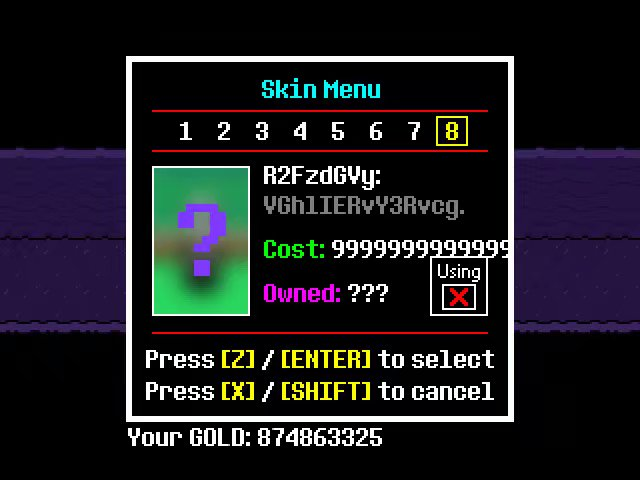

# 1.12.[BASE]关于游戏中的乱码（无聊向）

在游戏中，普通怪物的语言会呈乱码状，这其实是用Base64编码过的一串代码，是可以解码翻译的

【Glitchsun】

普通状态：\*shiver\*

![[Glitchsun]普通状态]([Glitchsun]普通状态.jpg)

Console/安慰：thank!

![[Glitchsun]安慰]([Glitchsun]安慰.jpg)

Terrorize/恐吓：no!!

![[Glitchsun]恐吓]([Glitchsun]恐吓.jpg)

【Froglitch】

普通状态：croak.

![[Froglitch]普通状态]([Froglitch]普通状态.jpg)

Talk/交流：croak?

![[Froglitch]交流]([Froglitch]交流.jpg)

Joke/讲笑话：haha! :3

![[Froglitch]讲笑话]([Froglitch]讲笑话.jpg)

【Glitch Bob】

普通状态：Hello?

![[Glitch Bob]普通状态]([Glitch Bob]普通状态.jpg)

Ignore/忽视：Why...? ;-;

![[Glitch Bob]忽视]([Glitch Bob]忽视.jpg)

Say hello/打招呼：HELLO!!

![[Glitch Bob]打招呼]([Glitch Bob]打招呼.jpg)

【Glitch Dog】

无论什么状态都是Qk9SSw，翻译过来是BORK

![[Glitch Dog]任何状态]([Glitch Dog]任何状态.jpg)

同样，第8个皮肤的代码也是可以翻译的

Gaster:

The Doctor