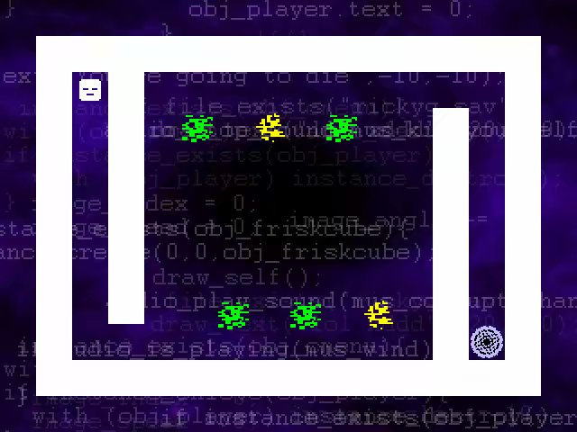
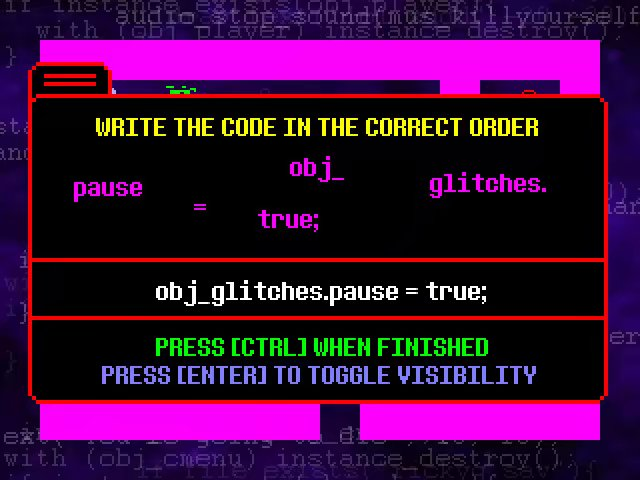
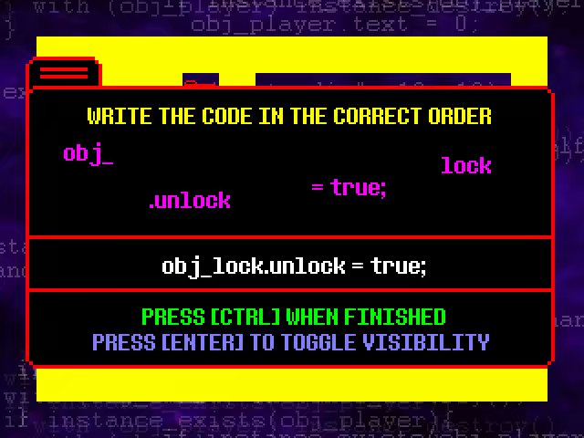

# 1.11.[END]Play the Ending模式介绍

当你拿到Master Sword后去Village的教堂，作者RickyG会开放Play the Ending选项，你可以在进入游戏的主菜单界面选择这个选项

其实就是作者想让你帮他敲代码（误）

操作方法：方向键移动，ALT复位，CTRL确认，ENTER半透明

【白】总体不难，重在上手

第1关

第2关

with(obj_glitches)instance_destroy();

作用：摧毁错误（就是那些动的和不动的开花）

第3关

obj_portal.activated = true;

作用：开启传送门（圈上有叉的）

第4关

【紫】需要借助ENTER来掌握时机，否则只能ALT

第1关

obj_glitches.pause = true;

作用：使错误静止（时停，推荐配合ENTER键使用，效果如下）

第2关

第3关

第4关

【黄】出现传送阵和锁，难度进一步提高

第1关

teleport(obj_friskcube,obj_telepad);

作用：传送到传送板上

第2关

第3关

obj_lock.unlock = true;

作用：开锁

【绿】无提示，需要自己使用代码，关卡内有坑

第1关

本关应先使用传送，后使用开锁（代码上上面找去），如果没有攻略你可能不止一次看到这里（笑）

第2关

本关应先使用传送后使用杀怪，右半部分有些难，把握时机

第3关

左传送门通往第1关，右传送门通往第4关

本关应先使用杀怪后使用传送（如果想作死直接开锁就行）

第4关

传送门分别传送到第1关，第2关，第1关，第3关，第1关

本关应先使用杀怪后使用传送，在外面绕一圈走门

【灰】

作者讲话

作者讲完后按M键

W.D.Gaster讲话

完后是结局致敬一类的

之后还会有一次Gaster讲话

此时可以按ESC退出了，该模式可重复玩