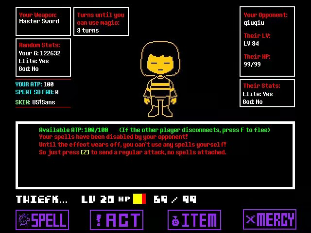
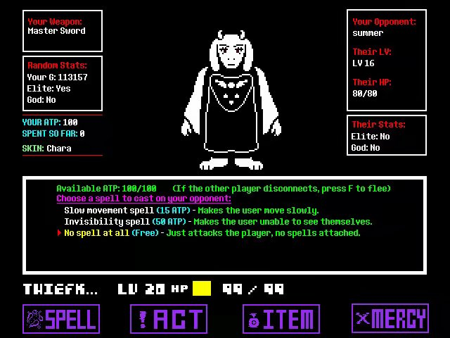

# 1.9.[PVP]关于PVP的基本介绍

这张图片是我和一外国佬PVP时对方攻击回合时我截取的

该图片上的各个部分解释如下（summer翻译）

PVP战斗的流程为：发起者的回合——发起者攻击中——迎战者的回合——迎战者攻击，不断重复直至一方HP归零

PVP胜利者获得75G，失败者无经济损失

以下将会让你了解PVP并学会如何使用PVP的功能

①如何发起PVP申请/如何给其他玩家下战书

发起PVP，你需要按一下P，如果能弹出一个窗口，当前你的所在位置就是能PVP的

如果没有弹出窗口，你可能需要像地图中心靠拢或更换地图

一场PVP建议发生在Throne Room或The VOID的刷怪房，前者回血方便，后者人多

按P弹出窗口后，输入对方ID并按ENTER发起PVP申请，按CTRL将弹出窗口关闭

发起PVP申请后，对方会看到你的头上顶着PVP的标志，在此过程中你依然可以按CTRL取消等待

②如何加入PVP/如何接受PVP申请/怎么应战书

当你屏幕下方显示有人要打架时，说明该地图内有人向你发送了PVP申请

找到他，你会发现他头顶上标有PVP标志，走向他，和其接触便可开始一场PVP

当你进入PVP战斗时，你会发现左下角FIGHT变成SPELL了

下面介绍PVP的按键功能

①SPELL

里面有很多魔法，可以用于在对面躲避你的弹幕攻击时给对面增加负面状态/Debuff

使用魔法需要消耗ATP，ATP是一种类似于MP的单位，初始上限为30，最高上限为100，可以通过使用Potion增加ATP上限

10ATP Slow movement spell/减速

使对方在该回合内移动速度降低

30ATP Slower movement spell/高级减速

使对方在该回合内移动速度大幅度降低

45ATP Invisibility spell/隐身

使对方在该回合内无法看到自己的灵魂（看不到自机，很难躲避弹幕）

80ATP Disabling spell/禁魔

使对方在接下来的3个回合无法使用魔法

当你被禁魔，你的SPELL界面将会这样显示，左上角会标注你还有多少回合解除该状态

0ATP No spell at all

不对对方使用魔法，使对方保持正常状态应对你的弹幕攻击

当你的皮肤为Chara或sans时，你将无法使用高级减速和禁魔且剩余的魔法将额外消耗你5ATP

②ACT

功能键在PVP中的作用为和对方说话，进入聊天界面后可直接打字，按CTRL发送，按ALT返回【重点强调，按ALT返回】

一回合仅能与对面说一次话

③ITEM

恰药回血，在你恰药后本回合将视为你未使用魔法对对面发起攻击

④MERCY

PVP中卵用没有

由于是DEMO版本，PVP中难免会遇到对方掉线的情况，若你认为对方已掉线，你可以通过以下方法紧急脱出战斗

如果这是你的回合，随便做些什么以进入对方的回合

如果这是对方的回合，当右上角进度条归零，你可以按F逃跑

值得一提的是，对方未掉线你可以可以等待进度条归零时逃跑，不过在正式的PVP中还请尊重PVP战斗，就算输了也没什么大损失，不是吗？*(注:现在有段位一说2333)*

基本介绍结束，关于其他PVP介绍可以看其他的帖子

比如不同皮肤的不同弹幕攻击一类的