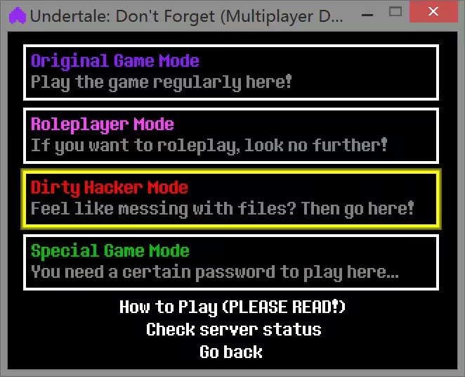
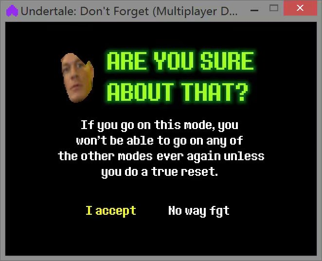
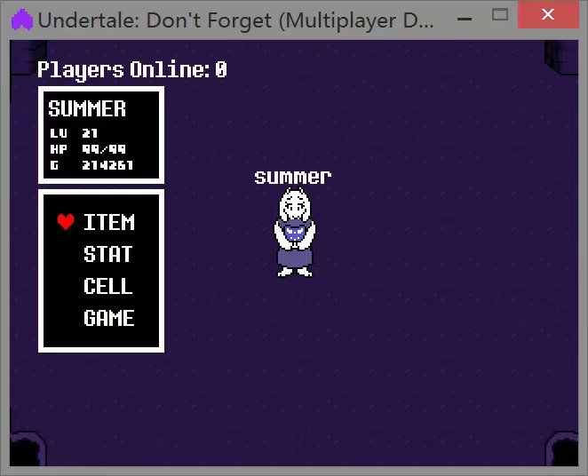
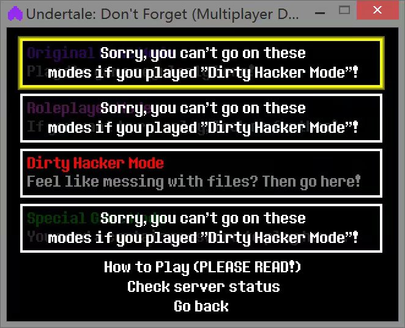
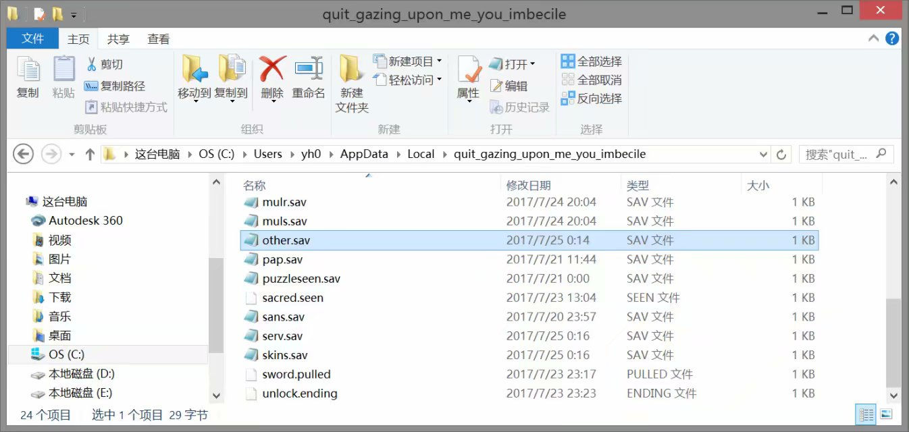
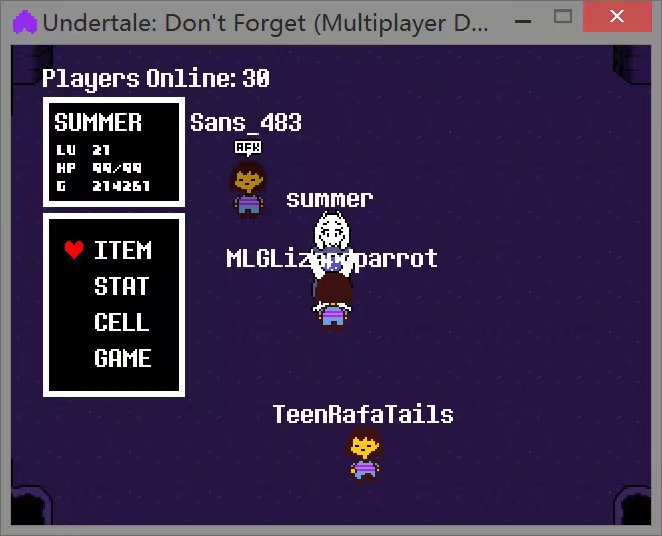
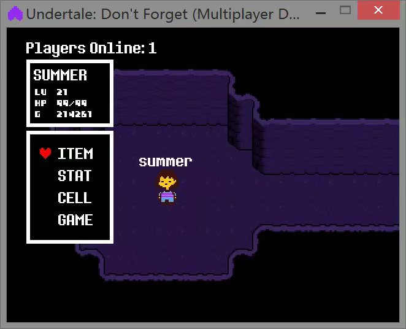
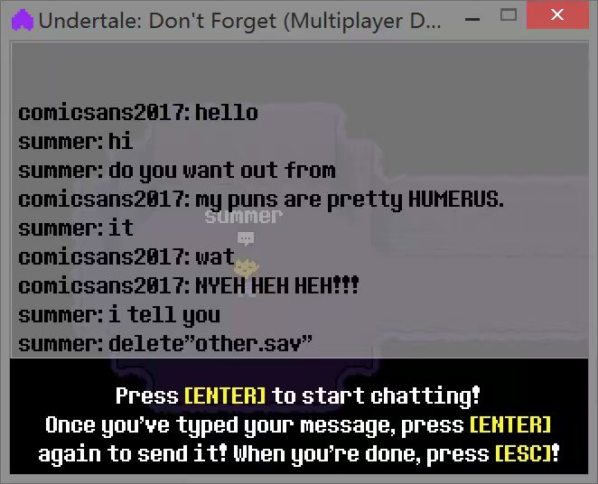

# 1.8.关于Dirty Hacker Mode

*注:好吧 Dirty Hacker Mode在很早之前的版本就已经被删除了*

*这是以前的关于Dirty Hacker Mode相关教程*

*如果想了解当初的情况，往下翻*

不论你是不小心还是故意的，进了dirty hacker服务器就别想选其它服务器了233（这一点有点像r星嘛），其实不然，既然做了一名“肮脏骇客”就应该对得起这个名号，用你的双手，走出这一片阴霾

当你选择这一个服务器的时候，

作者会给予以下警告

然后当你打开时，你会发现

，

，

，

，

，

，

，

，

，

，

，

，

，

，

，

空无一人2333，除了这个和原版服务器没有区别

然后再次进入服务器选项，是这样的画面：

没错你进不了其它服务器了，很多人为此重置但也没有用

等等！！！重置没有用？

那么换账号吧233

也没有用！

那么这就是本地文件的锅咯

，

，

打开C:\Users\你的计算机名\AppData\Local\quit_gazing_upon_me_you_imbecile

然后将里面的other.sav删除

，

你又可以在原来服务器里快乐玩耍了2333

附录1:

其实dirty hacker里还是有人的

我还“help it out”2333

附录2:并不是所有人的游戏目录就是这个，我的就是C:\Users\Admin\AppData\Local\quit_gazing_upon_me_you_imbecile 所以你们一定要找好自己的游戏目录