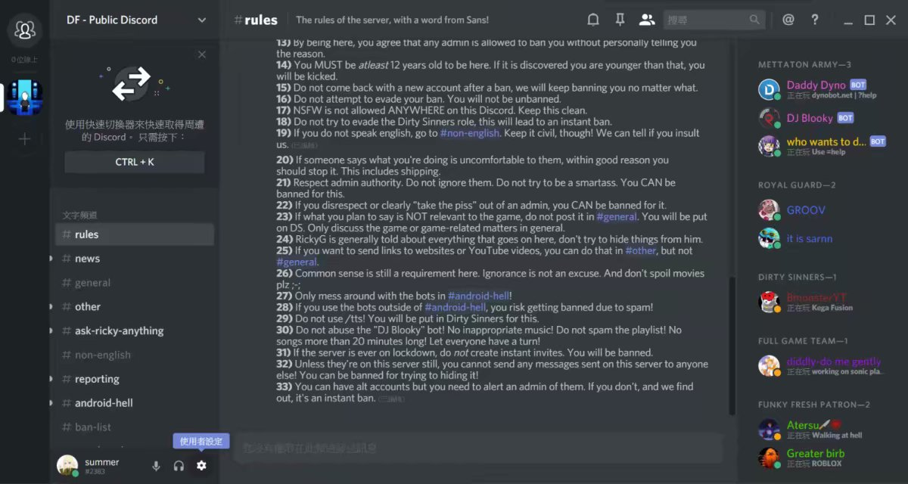
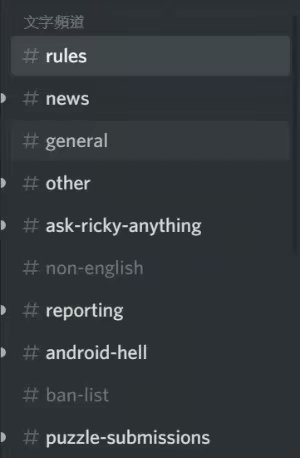
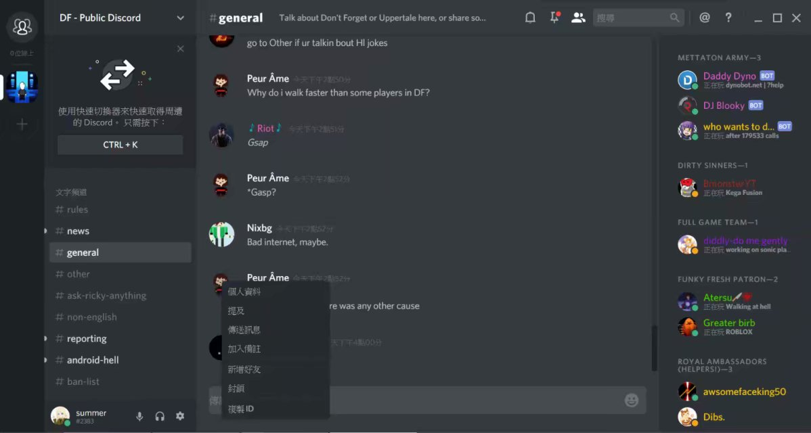
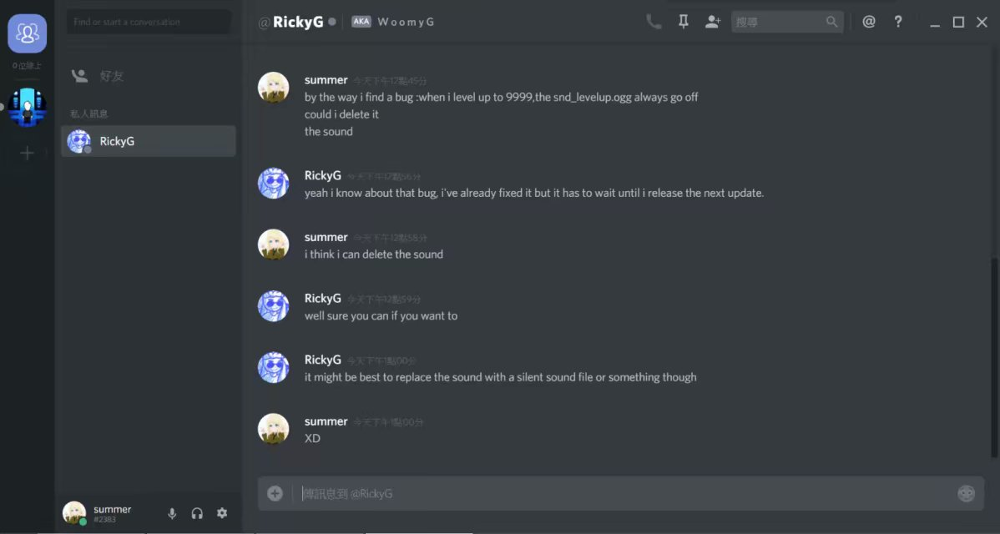
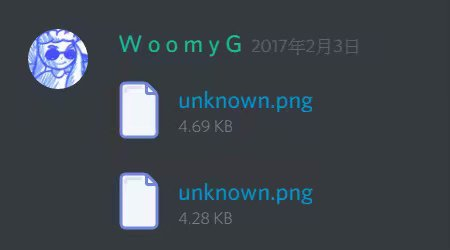
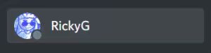
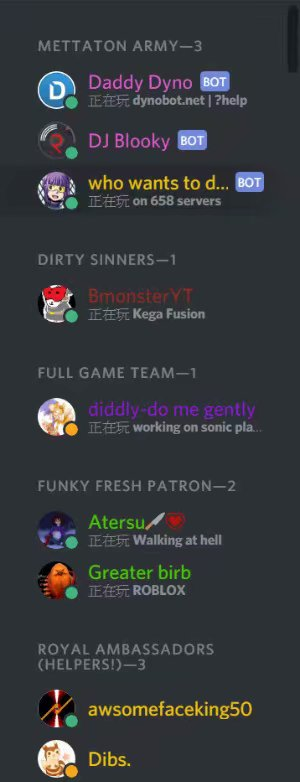
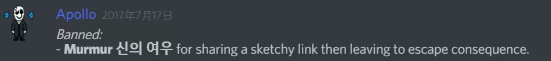

# 1.14.如何加入DF官方群聊

（加入群聊需要：健V康P上N网）

首先你需要download一个Discord APP（群文件里面有）或者直接使用网页版<https://discordapp.com/invite/V4dKsa8>一点开链接就自动加入dont forget的群聊服务器，但是在那里你还是需要注册一个账号

补充：成功登入网页版里面会推荐客户端，先注册下来再说

注册完之后验证邮箱，随后你会得到这样一个界面（我所展示的是APP版本）

是不是很清fan爽za

没事我会教你怎么使用

诶你的怎么是中文版的

点击右下角的小齿轮就可以设置语言，顺便多花点时间去看看设定、添加个人资料，以免造成不便

然后是聊天系统（左下角的列表）

与国内群聊不同，Discord的群聊可以分成很多频道

当然上图所展示的是DF官方群聊的频道

翻译依次是

1：规则

2：新闻

3：常规

4：其它

5：询问作者问题（反馈）

6：非英语区

7：报告

8：安卓地狱（好像是可以调戏机器人）

9：封禁列表

10：彩砖谜题（DF的一个小游戏）区

11：剧透？？？

12：作者的其它游戏

下面是一些语音频道

1：英语聊天（带音乐）

2：英语聊天（没音乐）

3：更新透露

4：？？？

5：挂机频道

↑具体频道用途看1：规则

想要和一个用户私聊或者加好友右键他的头像

私人聊天界面在（左上角）

哦对了作者是这货（不排除他以后会更改头像或者ID）*(注:头像确实改了2333)*

（分别处于群聊和私聊界面）

右边栏的是在线玩家，不同的颜色代表拥有不同的权限

（但你必须记住的是）

蓝色名字的是管理（靠我差点也是了）*(注:确实呢XD)*

千万不要在他们的面前作死

不然被banned，你就可以在9：封禁列表看到你的名字了