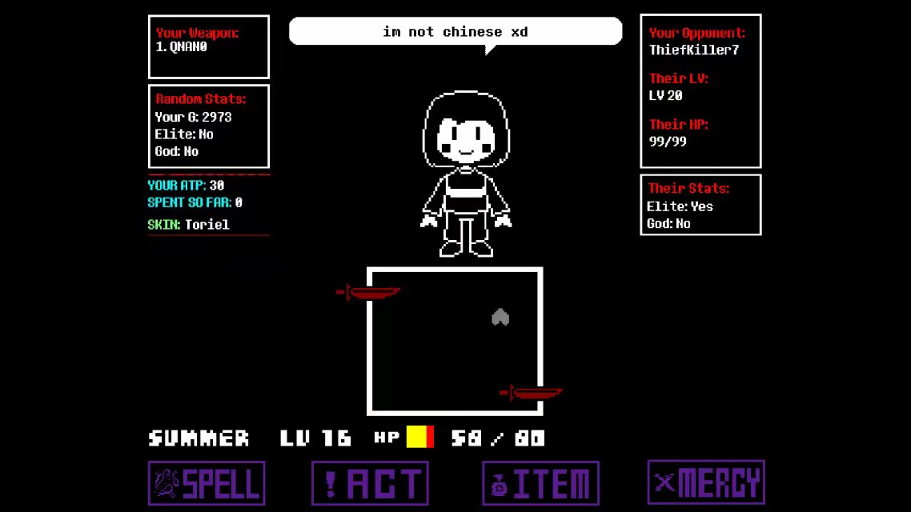
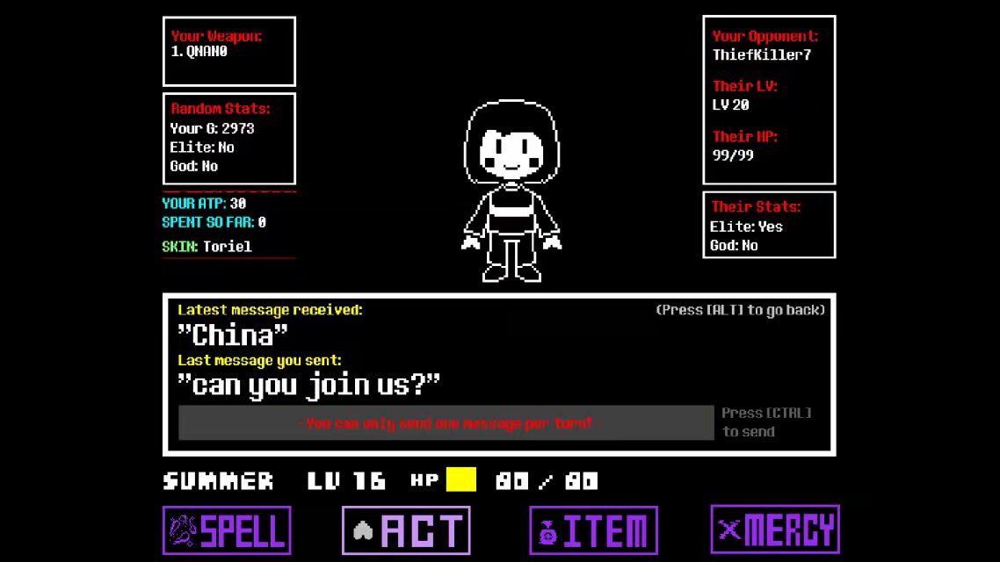
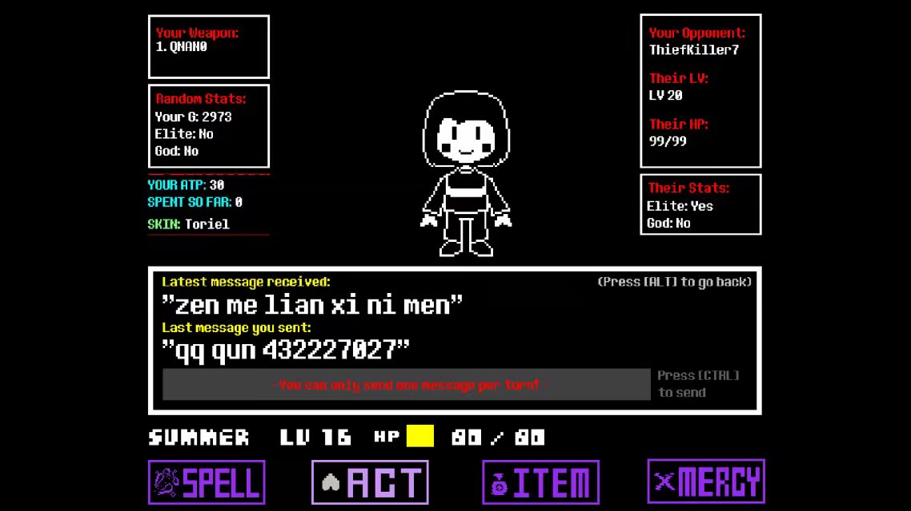

# 1.13.如何在游戏当中安利别人加群

为扩大群内势力，让丰富的资源不被白白浪费，我将教大家如何去安利别人加入our group

首先我们会遇到4种类型的玩家

1：与你正常交流的外国人

2：不懂你在说个**的人

3：与你正常交流的国人

4：不说话的人

*（此教程由@summer制作@ThiefKiller7协助制作）*

1：不管是遇到什么人，首先和他打声招呼，或是直接询问他where are you come from（表意即可）[个人推荐第一种]

从他的回答中看出，他是一个老美，安利失败:(

[除非想和中国人做朋友，但一般的外国人使用的是Facebook作为社交工具，俄国人则是vk]

最后别忘了和他打声招呼，如果他非要问你什么意图，告诉就好

2：有的人不知道你在说什么，还有一部分人会认为你是在角色扮演（比如有人在用frisk面对我的toriel时，对我说let me go233）

这时候你应该给他解释清楚，为了简略表述，可以直接告诉你的意图

看上去不是国人，安利失败x2 :(

3:一如既然先询问

看上去这次是国人了，询问他是否加我我们

现在直接贴群号码（432227027）就好了

安利成功:)

4：如果对方一直不说话，也许是因为不知道如何输入或是没有注意头上的对话框

此时将你的话全部说完，运气好对方也许会回复（qiuqiu就是这样被我安利来的2333）

安利小技巧

1：使用白色ID，这会使更多的新人愿意与你PVP

2：如果新人向你提问，务必告诉他，即使他没有决定要去加群

3：告诉他加群的好处（比如有攻略，或是一个交流的平台）

4：如果话没有说完，战斗就结束了，按t键在聊天框中与他对话（最好不要把群号挂上去，免得被ban）

5：对于新手加群表示欢迎，并且及时展示我们的实力以及帮助他解决问题

*附注:这是整理这篇教程是写的了2333*

*不要在群体聊天中广播群号了2333*

*结局1:被别人当成随意打的数字被别人反复输入*

*结局2:刷多了禁言*

*解决3:发现是安利可能会封号*

