# 1.3.羊妈皮肤使用心得

在overworld中

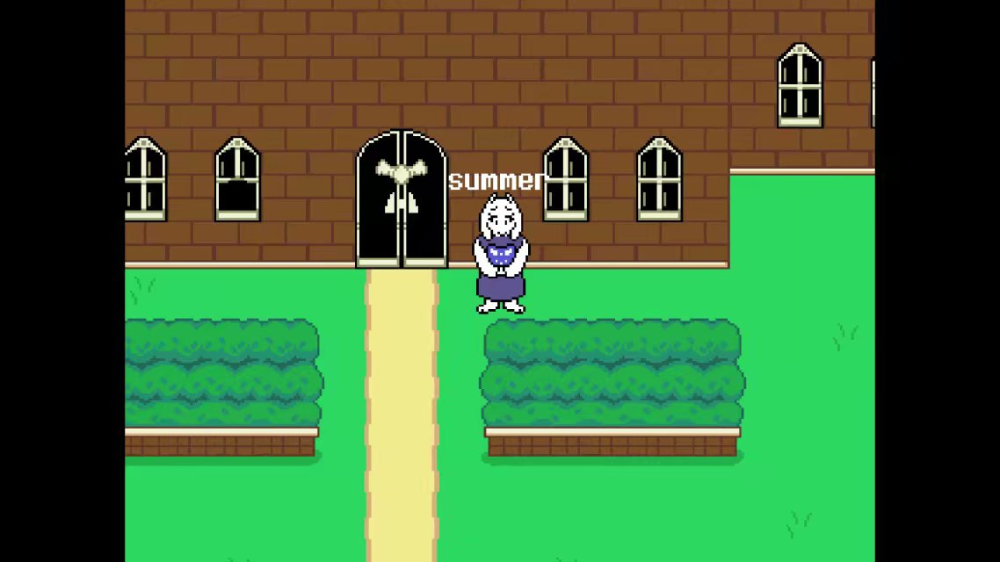

在afk/挂机模式中

在dancing/自嗨模式中

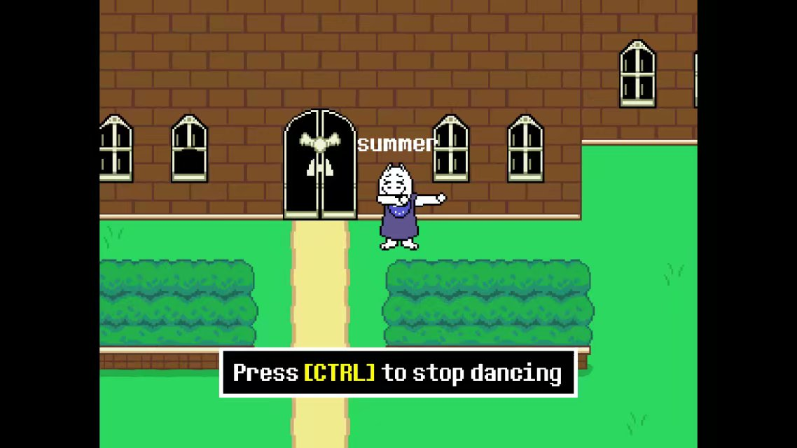

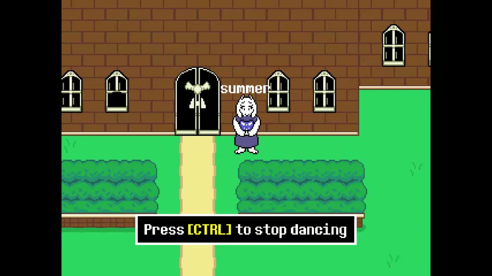

遭遇战（PVP）中

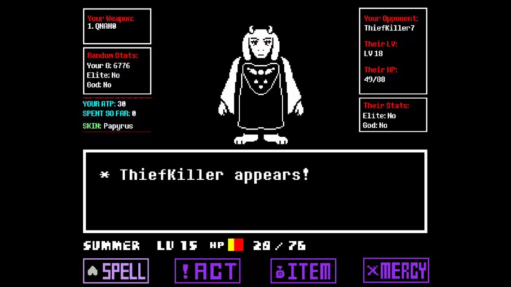

关于PVE

和其它怪物皮肤/skin一样，Toriel/羊妈遭遇怪物时,会发出[..!]的警告

同时Toriel/羊妈的灵魂不像人类的决心一样，她是一个倒置的白心(其它怪物皮肤/skin同理）

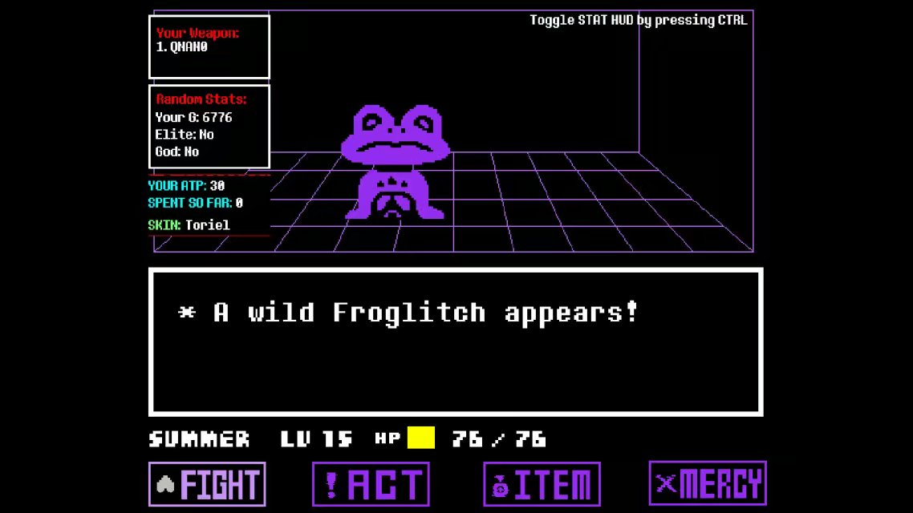

关于PVP

Toriel/羊妈拥有三种攻击

1：从上到下的火焰，有5~6条轨道

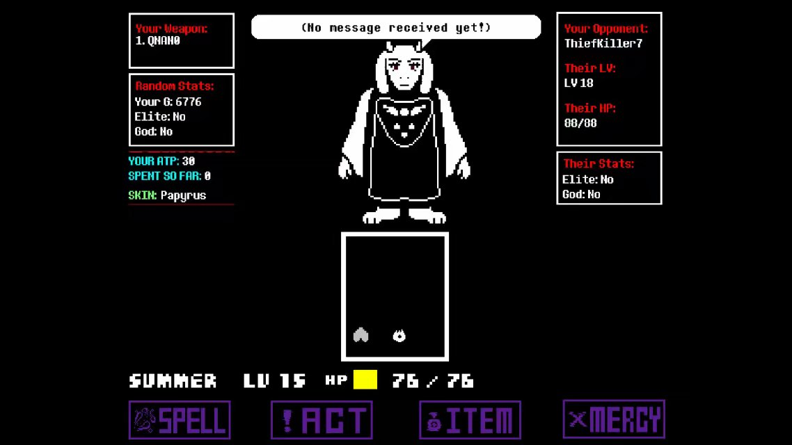

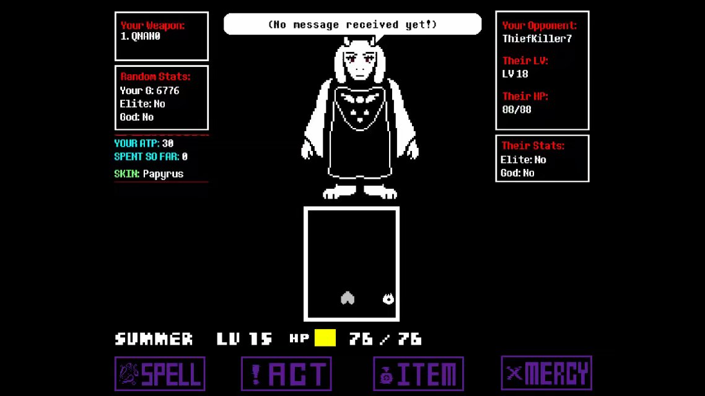

该攻击的速度不快，比较容易躲闪，但是对方使用30ATP降速的时候就应当小心

该攻击与人类的刀子类似，但不同的是，火焰是从框格内突然出现，且高度随机，所以面对的时候应当尽量把高度降低

框格变到最小，是该攻击的前兆

2：X形交叉的火焰，三个一组，六个一对

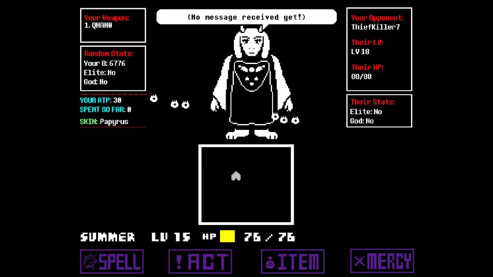

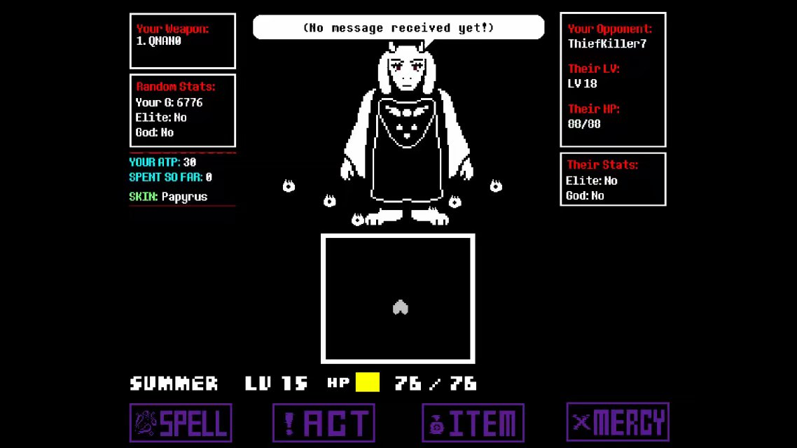

该攻击类似于人类的“友谊颗粒”，对于新手以及状态不佳的人比较棘手

面对该攻击最好平移来躲避，不然你原本想躲避一组却被另一组击到了233

3：类似papyrus/帕派瑞斯的密集阵

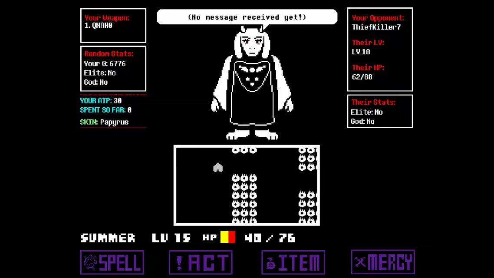

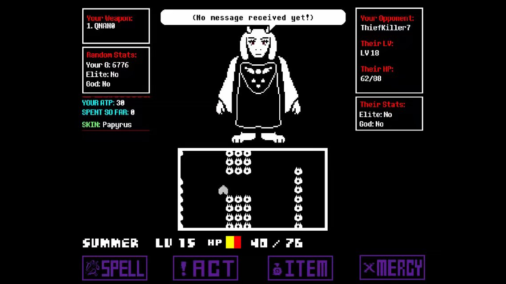

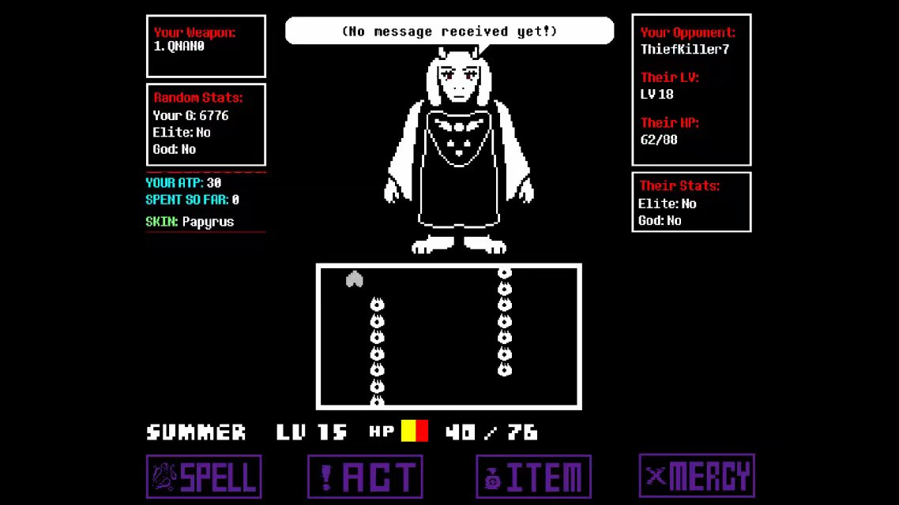

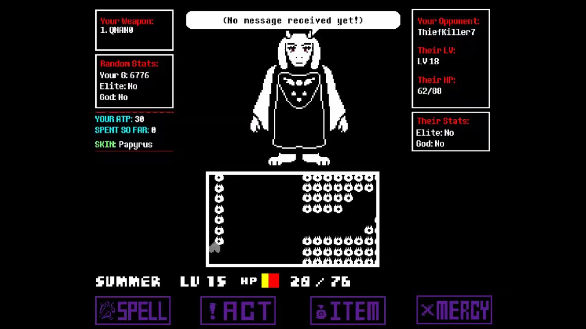

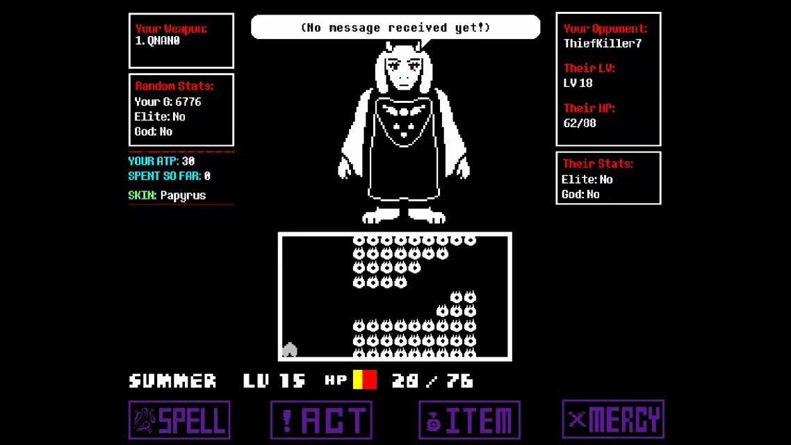

该攻击相比papyrus/帕派瑞斯，由于不受“蓝色攻击”的束缚，更容易躲避，但是只要被减速就非常棘手，哪怕只有10ATP，这一性质类似于人类的树枝

火焰一般等不到完全走过，攻击就结束了，所以图5的阵型一般不具有威胁，但也应该小心，不然你突然脸黑了呢233（反正我遇到过一次）

综上所述，Toriel/羊妈在PVP中处于劣势，但是这么可爱的角色，~~不买你的良心不会痛吗？~~(现在已经按照等级解锁皮肤了)

*Toriel/羊妈没有字体加成